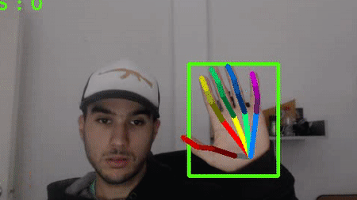

# Standalone Hand Keypoint Detector

Detects hands keypoints seen on any video or live camera.

<p align="center">
    
</p>

**Project updated!** Finally I could manage to get the time to update it to the last changes on OpenPose and add some more functionality :) 

This hand detector is currently made by integrating two third party tools:
* [Handtracking by Victor Dibia](https://github.com/victordibia/handtracking) - This neural network is used to detect the bounding boxes of hands seen on a image
* [OpenPose](https://github.com/CMU-Perceptual-Computing-Lab/openpose) - The found bounding boxes are fed into OpenPose Hand Keypoint detector.

To run, do just

```
python run.py
```

It will detect and display hands found on your webcam stream.

Only left hands are find correctly. This is because the neural network the Handtracking project uses is unable to distinguish if the hand is a left or right hand, and OpenPose needs this information to fully detect the hand keypoints.


## Set up
### Prerequisites
* [OpenPose](https://github.com/CMU-Perceptual-Computing-Lab/openpose) - Make & install Openpose with the Python module enabled.
* OpenCv
* Tensorflow

### Configuration
- **config.py**: Write there the path where you installed OpenPose
- **detection_keypoints.py** Make sure python is able to find OpenPose python lib path!

### Future improvements
Stay tuned! Following versions coming soon, enabling left and right hand detection and a own Neural Network to make a fully contained project :)
